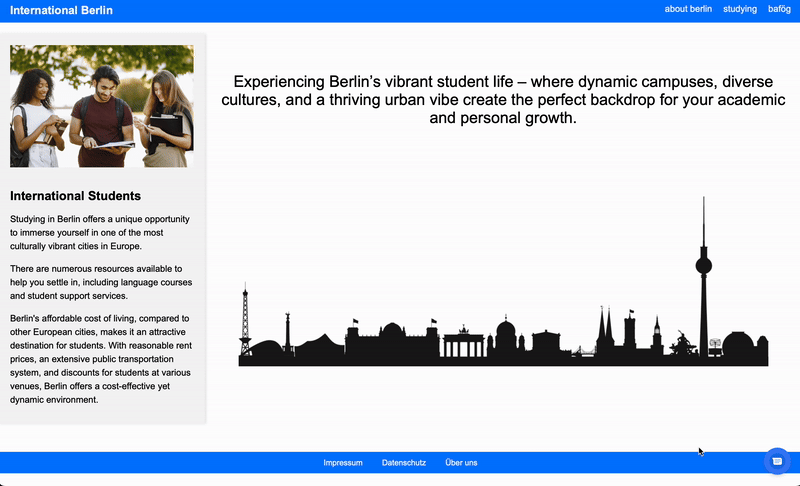

## Chatbot LIA
 


#### Ein Projekt in Kooperation mit CityLab Berlin!      


#  Chatbot für internationale Studenten in Berlin mit Flowise AI
Der Chatbot LIA für international Studierende in Berlin ist ein intelligentes Assistenzsystem, das internationalen Studierenden in Berlin hilft, sich im deutschen Bildungssystem und im alltäglichen Leben zurechtzufinden. Dieser Chatbot, entwickelt mit Flowise AI, unterstützt Studierende bei wichtigen bürokratischen Prozessen, wie z.B. dem Umgang mit BAFöG, der Immatrikulation, Visaverlängerung und vielem mehr.

## Visuals


# Installation
In der folgenden Installationsanleitung wird Schritt für Schritt beschrieben, wie der Chatbot lokal auf dem systemeigenen Computer installiert und einrichtet werden kann.

### 1. Flowise AI installieren
Node.js herunterladen und installieren (Version >= 18.15.0)
Stell sicher, dass Node.js in der Version 18.15.0 oder höher auf deinem System installiert ist. Falls nicht, lade die entsprechende Version von der [offiziellen Node.js Website](https://nodejs.org/) herunter und installieren sie.

Installiere Flowise global auf deinem System, indem du den folgenden Befehl in deinem Terminal ausführst:

1. Install Flowise
    ```bash
    npm install -g flowise
    ```
2. Start Flowise
    ```bash
    npx flowise start
    ```
3. Open [http://localhost:3000](http://localhost:3000)

### 2. Ollama installieren
Um den Chatbot korrekt nutzen zu können, muss Ollama installiert werden. Falls noch nicht installiert, können folgende Befehle im Terminal ausgeführt werden:

1. LLM
    ```bash
    ollama pull llama 3.1
    ```
2. Modell
    ```bash
    ollama pull all-minilm
    ```
    
 ### 3. JSON Datei in Flowise  importieren
Nach erfolgreicher Installation findest du im GitHub Repository eine JSON Datei. Diese Datei enthält alle notwendigen Konfigurationen und kann direkt in Flowise geladen werden. Öffne Flowise, erstelle ein neues Projekt, navigiere zur Import-Funktion und lade die JSON-Datei.

### 4. API Key erstellen
Sobald die JSON Datei erfolgreich importiert wurde, muss ein API Key über Pinecone erstellt werden. Dies ermöglicht die Speicherung der Informationen aus den Datenquellen in eine Vektordatenbank. Der generierte API Schlüssel wird in der Nodes der Vektordatenbank eingebunden unter **"Connect Credential"**. 

### 5. Datenquellen anbinden
Im Repository sind Datenquellen in Form von Links hinterlegt, die über Webscraping eingebunden werden können. Verwende dazu den Node **"Cherrico Web Scraper"** in Flowise, um diese Informationen aus den Datenquellen zu extrahieren.

Schritte zur Einbindung:
1. Füge den Node **"Cherrico Web Scraper"** in deinem Chatflow hinzu und trage die entsprechenden Links zu den Datenquellen ein.
2. Binde den **"Document"**-Node an den **Pinecone Node** an, um die Daten in der Vektordatenbank zu speichern.
3. Sobald die Datenquellen erfolgreich eingebunden und gespeichert wurden, müssen die Daten über den Button **"Upsert"** oben rechts in die Vektordatenbank eingebunden werden. Dann ist der Chatbot einsatzbereit. Dieser kann nun Antworten basierend auf den gescrapten Informationen generieren.

Die eingebundenen Datenquellen werden in der Vektordatenbank gespeichert und müssen nur einmal hinzugefügt und geladen werden, um dauerhaft genutzt zu werden.
Die für den Chatbot LIA verwendeten Links sind hier zu finden. 

# Usage
Nach der erfolgreichen Installation und Einrichtung des Chatbots kannst du diesen über eine prototypische Website testen. Im GitHub-Repository befindet sich eine `index.html` Datei, die als eine einfache Benutzeroberfläche für den Chatbot dient.

Schritte zur Nutzung:
1. Öffne die Datei `index.html` in einem Webbrowser.
2. Der Chatbot wird auf der prototypischen Website geladen und steht für Interaktionen bereit.
3. Teste den Chatbot, indem du verschiedene Fragen und Anliegen eingibst, insbesondere zu den Bereichen BAFöG-Anträge, Visum-Anträge und Hochschuleinschreibungen.
4. Der Chatbot wird auf Basis der hinterlegten Konfigurationen und Nodes (in Flowise) Antworten und Hilfestellungen geben. Wenn vorab passende Daten geladen wurden.

Diese Website dient als Testumgebung für den Chatbot, bevor er in eine vollwertige Anwendung integriert wird.

# Project status
If you have run out of energy or time for your project, put a note at the top of the README saying that development has slowed down or stopped completely. Someone may choose to fork your project or volunteer to step in as a maintainer or owner, allowing your project to keep going. You can also make an explicit request for maintainers.

# Contacts
**Diren Akkaya**    
diren.akkaya@student.htw-berlin.de

**Thao Do**  
phuong.do@student.htw-berlin.de

**Hiba Farhat**     
s_farhath21@stud.hwr-berlin.de


**Melody Fuhrmann**  
melody.fuhrmann@student.htw-berlin.de  
